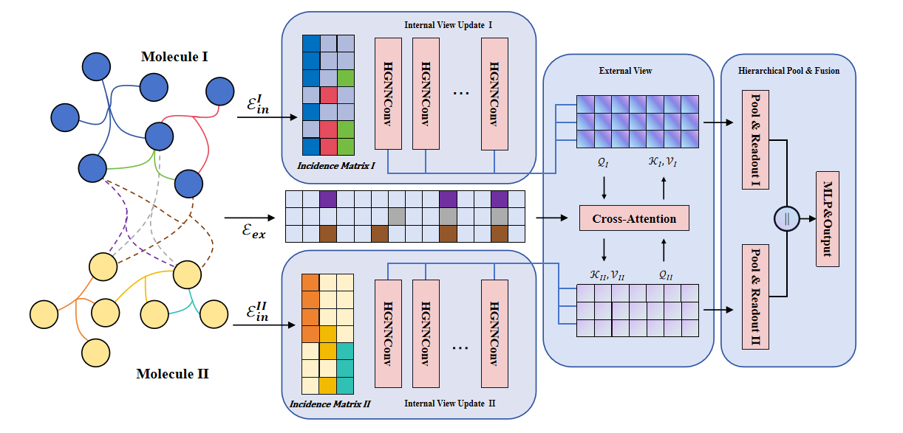

# Forecasting the Molecular Interactions: A Hypergraph-based Neural Network for Molecular Relational Learning

This is a PyTorch implementation of IE-HGNN model and discussion experiments proposed by our paper "Forecasting the Molecular Interactions: A Hypergraph-based Neural Network for Molecular Relational Learning".

## 1.Overview

			<!--块级封装-->
    
	<!--将图片和文字居中-->
    
     		<!--换行-->
    Fig.1 An overview of IE-HGNN model.	<!--标题-->
    

