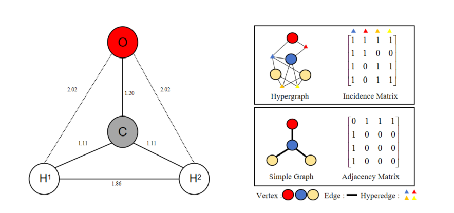

## Forecasting the Molecular Interactions: A Hypergraph-based Neural Network for Molecular Relational Learning

This is a PyTorch implementation of IE-HGNN model and discussion experiments proposed by our paper "Forecasting the Molecular Interactions: A Hypergraph-based Neural Network for Molecular Relational Learning".

### 1. Overview

<div>			<!--块级封装-->
    <center>	<!--将图片和文字居中-->
    
    <br>		<!--换行-->
    Fig.1 An overview of IE-HGNN model.	<!--标题-->
    </center>
</div>

Our study presents a novel hypergraph-based neural network model IE-HGNN, designed to enhance the prediction of molecular relationships. We introduce an innovative hypergraph construction algorithm with a mechanism of redundancy prevention, which is applied to model pairs of molecules, such as a protein with a ligand or a drug to a drug.  We introduce a bi-view interaction update neural network that handles message passing and information updates for both intra- and inter-molecular interactions.

### 2. Installation

Set up a python environment for version 3.8.13 and clone the Github repo.

```
$ pip install torch==1.12.1+cu113
$ pip install torchvision==0.13.1+cu113
$ pip install torch_geometric==2.2.0
$ pip install torch_scatter==2.1.1
$ pip install torch_sparse==0.6.16+pt112cu113
$ pip install torch_cluster==1.6.1
$ pip install numpy==1.23.1
$ pip install rdkit==2022.9.3
```

### 3.Datasets

You can download the datasets via reference URL in the follow table.

|            Datasets             |                         Description                          |     Tasks      |                          Reference                           |
| :-----------------------------: | :----------------------------------------------------------: | :------------: | :----------------------------------------------------------: |
| LEP(Ligand Efficacy Prediction) | To predict whether the ligand activates the protein or inhibit. | Classification |              https://zenodo.org/record/4914734               |
|            ZhangDDI             |   To forecast whether two drug molecules interact or not.    | Classification | https://github.com/isjakewong/MIRACLE/tree/main/MIRACLE/datachem |

### 4. Training

To train the IE-HGNN, you have to exec the following commands.

```
# For drug-drug interaction prediction, you can
$ python train_ddi.py
# For protein-ligand interaction prediction, you can
$ python train_lep.py
```

### 5. Supplementary 

##### 5.1 Hypergraph and simple graph

​	Different from simple graphs, a hypergraph can describe high-order connection among molecules, and its edges are called hyperedge, which could link two or more nodes in a graph. You can see the difference from an example of a 

<div>			<!--块级封装-->
    <center>	<!--将图片和文字居中-->
    
    <br>		<!--换行-->
    Fig.2 An illustration of a formaldehyde molecule.	<!--标题-->
    </center>
</div>

Fig.2 is a schematic depiction of a formaldehyde ($CH_2O$) molecule. The distances of the bonds in the figure are approximations and are primarily intended for illustrative purposes only. The unit of length used in the figure is $\AA$, and to distinguish between the two hydrogen atoms, they are labeled with superscript numbers. In this representations, solid lines are utilized to represent edges where the bond distance exceeds 2$\AA$, while dotted lines are employed for those with distance less than 2 $\AA$.

##### 5.2 Molecular Relational Learning

Relational learning refers to predicting the interaction relationships between pairs of entities. When it comes to a pair of molecules, this concept translates to molecular relational learning. Notably, classical molecular relational learning tasks within this framework encompass predictions of protein-ligand interactions and drug-drug interactions.

### 6. Acknowledgements

This work was sponsored by the Key Program of Science and Technology of Yunnan Province (No.202302AB080020, 202102AB080019-3), Key Research Project of Zhejiang Laboratory (No. 2021PE0AC02), Key Project of Shanghai Zhangjiang National Independent Innovation Demonstration Zone(No. ZJ2021-ZD-006). The authors gratefully appreciate the anonymous reviewers for their valuable comments.

